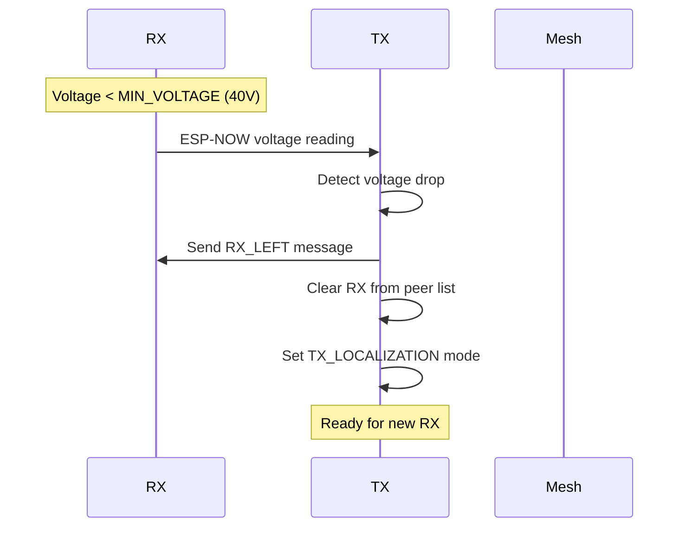

## Table of Contents
- [Quick Start Guide](#quick-start-guide)
- [System Architecture](#system-architecture)
- [Security Implementation](#security-implementation)
- [API & Payload Documentation](#api--payload-documentation)
- [Communication Procedures](#communication-procedures)
- [Configuration & Customization](#configuration--customization)
- [Known Issues & Debugging](#known-issues--debugging)
- [Troubleshooting](#troubleshooting)

---

## Quick Start Guide

### Prerequisites

**Hardware:**
- ESP32-C6 development boards (recommended for WiFi 6)
- ESP32 classic boards (fully supported)
- I2C sensors (for TX/RX detection)
- WiFi router with internet access

**Software:**
- ESP-IDF v5.5.1
- Python 3.7+
- Git
- VSCode with ESP-IDF extension

### Board Compatibility

| Board | WiFi Standard | Performance | Recommended Use |
|-------|--------------|-------------|-----------------|
| **ESP32-C6** | WiFi 6 (802.11ax) | Best latency, power efficiency | Production deployment |
| **ESP32** | WiFi 4 (802.11n) | Good performance, proven stability | Development/testing |

The firmware automatically detects the target during compilation:
```bash
# VSCode ESP-IDF extension handles this automatically
# Or manually:
idf.py set-target esp32c6  # For ESP32-C6
idf.py set-target esp32     # For ESP32 classic
```

### Installation Steps

#### 1. Clone the Repository
```bash
git clone https://github.com/yourusername/bumblebee-mesh.git
cd bumblebee-mesh
```

#### 2. Configure Your Unit

Edit `main/include/unitID.h` to set your unit ID:
```c
#define CONFIG_UNIT_ID 1  // Change to unique ID (1-255)
```

Update WiFi credentials in menuconfig:
```bash
idf.py menuconfig
# Navigate to: Component config → Bumblebee Configuration
# Set SSID and Password
```

#### 3. Configure Security

Update MQTT settings in `main/include/mqtt_client_manager.h`:
```c
// MQTT Broker Configuration
#define MQTT_BROKER_HOST "15.188.29.195"
#define MQTT_BROKER_PORT 8883  // Secure TLS port
#define MQTT_USERNAME "bumblebee"
#define MQTT_PASSWORD "your_secure_password"  // CHANGE IN PRODUCTION!
```

Add CA certificate to `main/mqtt_client_manager.c`:
```c
// Copy content from mosquitto/certs/ca.crt
static const char *mqtt_ca_cert = \
"-----BEGIN CERTIFICATE-----\n" \
"MIIDszCCApugAwIBAgIUQtkzgohELHulJcPxI3OLmsWEMnswDQYJKoZIhvcNAQEL\n" \
"... (full certificate content) ...\n" \
"-----END CERTIFICATE-----\n";
```

#### 4. Build and Flash

```bash
# Build the project
idf.py build

# Flash and monitor
idf.py -p /dev/ttyUSB0 flash monitor
```

#### 5. Verify Operation

After flashing, you should see in the serial monitor:
```
I (XXX) MAIN: ========================================
I (XXX) MAIN:   Bumblebee WiFi Mesh
I (XXX) MAIN:   Firmware Version: v0.2.0
I (XXX) MAIN:   Build Date: YYYY-MM-DD HH:MM:SS
I (XXX) MAIN:   ESP-IDF: 5.5.1
I (XXX) MAIN: ========================================
I (XXX) MAIN: TX/RX unit detected via I2C scan
I (XXX) wifiMesh: Mesh network formed
I (XXX) MQTT_CLIENT: Connected to broker (TLS)
```

---

## System Architecture

### Overview

Bumblebee implements a **three-layer communication architecture**:

1. **ESP-NOW Layer**: Direct TX↔RX peer-to-peer (low latency, encrypted)
2. **WiFi Mesh-Lite Layer**: TX↔TX mesh networking (self-healing, multi-hop)
3. **MQTT/TLS Layer**: Cloud connectivity (secure, authenticated)

### Technology Stack

| Component | Technology | Purpose |
|-----------|-----------|---------|
| **MCU** | ESP32-C6 / ESP32 | RISC-V/Xtensa, WiFi 6/4 support |
| **RTOS** | FreeRTOS | Multi-tasking, priority scheduling |
| **Framework** | ESP-IDF 5.5.1 | Native Espressif SDK |
| **Mesh** | ESP-WIFI-MESH-LITE | Lightweight mesh protocol |
| **P2P** | ESP-NOW | Direct peer communication |
| **Protocol** | MQTT over TLS | Secure IoT messaging |
| **Data Format** | JSON (MQTT) / Binary (ESP-NOW) | Flexible & efficient |

---

## Security Implementation

### 1. MQTT TLS/SSL Security

**Configuration:**
```c
// main/mqtt_client_manager.c
esp_mqtt_client_config_t mqtt_cfg = {
    .broker = {
        .address = {
            .hostname = MQTT_BROKER_HOST,
            .port = MQTT_BROKER_PORT,      // 8883 for TLS
            .transport = MQTT_TRANSPORT_OVER_SSL,
        },
        .verification = {
            .certificate = mqtt_ca_cert,    // CA certificate
            .skip_cert_common_name_check = true,  // For self-signed
        },
    },
    .credentials = {
        .username = MQTT_USERNAME,
        .authentication.password = MQTT_PASSWORD,
    },
};
```

**Security Features:**
- TLS 1.2 encryption
- Certificate validation (self-signed or CA)
- Username/password authentication
- Automatic reconnection with exponential backoff

### 2. ESP-NOW Encryption (Fully Working)

**Complete Implementation (MSK + LSK):**
```c
// main/include/wifiMesh.h
#define ESPNOW_PMK "pmk1234567890999"  // Primary Master Key
#define ESPNOW_LMK "lmk1234567890999"  // Local Master Key

// MSK encryption enabled for initial pairing
esp_now_peer_info_t peer_info = {
    .encrypt = false,  // Initially no encryption for discovery
};
```

**LSK Encryption Implementation (Working):**
```c
// Enable LSK encryption after peer discovery
static void esp_now_encrypt_peer(const uint8_t *peer_addr)
{
    esp_now_peer_info_t peer;
    ESP_ERROR_CHECK(esp_now_get_peer(peer_addr, &peer));
    
    // Enable encryption with Local Master Key
    peer.encrypt = true;
    memcpy(peer.lmk, ESPNOW_LMK, ESP_NOW_KEY_LEN);
    ESP_ERROR_CHECK(esp_now_mod_peer(&peer));
    
    ESP_LOGI(TAG, "LSK encryption enabled for peer "MACSTR, MAC2STR(peer_addr));
}
```

**Important Implementation Note:**
The key to successful LSK encryption is ensuring **both sides** encrypt the peer:
1. **TX/RX Side**: Calls `esp_now_encrypt_peer()` after receiving first message
2. **Master Side**: Also calls `esp_now_encrypt_peer()` after adding the peer
3. Both sides must use the same LMK key

**Encryption Flow:**
```c
// On Master (TX) side:
if (msg_type == DATA_ASK_DYNAMIC) {
    add_peer_if_needed(recv_cb->mac_addr);
    esp_now_encrypt_peer(recv_cb->mac_addr);  // Master encrypts RX peer
}

// On RX side:
if (first_message_received) {
    add_peer_if_needed(TX_mac_addr);
    esp_now_encrypt_peer(TX_mac_addr);  // RX encrypts TX peer
}
```

**Security Features:**
- **Dual Encryption**: Both MSK and LSK active
- **Bi-directional**: Encryption established on both sides
- **Dynamic**: LSK applied after initial handshake
- **Secure**: Prevents eavesdropping and replay attacks

### 3. Production Security Recommendations

```yaml
Development:
  - Passwords: Hardcoded (visible in repository)
  - Certificates: Self-signed
  - Firewall: Open to all IPs
  - Debug logs: Enabled

Production:
  - Passwords: Environment variables or secure storage
  - Certificates: Let's Encrypt or commercial CA
  - Firewall: Whitelist specific IP ranges
  - Debug logs: Disabled or ERROR level only
  - Additional: 
    - Certificate pinning
    - Mutual TLS authentication
    - Regular password rotation
    - Security audit logging
```

---

## API & Payload Documentation

### MQTT Topics Structure

```
bumblebee/
├── {unit_id}/
│   ├── dynamic          # Sensor telemetry data
│   └── alerts           # Alert conditions
└── control              # Global control commands
```

### Payload Formats

#### 1. Dynamic Payload (bumblebee/{unit_id}/dynamic)
```json
{
    "TX": {
        "id": 1,
        "macAddr": "AA:BB:CC:DD:EE:FF",
        "voltage": 75.5,
        "current": 1.8,
        "temp1": 32.5,
        "temp2": 33.1,
        "tx_status": "TX_DEPLOY"
    },
    "RX": {
        "id": 101,
        "macAddr": "11:22:33:44:55:66",
        "voltage": 95.3,
        "current": 1.2,
        "temp1": 28.5,
        "temp2": 29.0,
        "rx_status": "RX_CHARGING"
    }
}
```

**TX Status Enum:**
- `TX_OFF` (0): Pad is off
- `TX_LOCALIZATION` (1): Searching for scooter
- `TX_DEPLOY` (2): Charging active
- `TX_ALERT` (3): Alert condition

**RX Status Enum:**
- `RX_NOT_PRESENT` (0): No scooter detected
- `RX_CONNECTED` (1): Scooter detected but not charging
- `RX_MISALIGNED` (2): Poor coupling
- `RX_CHARGING` (3): Active charging
- `RX_FULLY_CHARGED` (4): Battery full
- `RX_ALERT` (5): Alert condition

#### 2. Alert Payload (bumblebee/{unit_id}/alerts)
```json
{
    "TX": {
        "id": 1,
        "macAddr": "AA:BB:CC:DD:EE:FF",
        "flags": {
            "overcurrent": 1,
            "overvoltage": 0,
            "overtemperature": 0,
            "FOD": 0
        }
    },
    "RX": {
        "id": 101,
        "macAddr": "11:22:33:44:55:66",
        "flags": {
            "overcurrent": 0,
            "overvoltage": 1,
            "overtemperature": 0,
            "FullyCharged": 0
        }
    }
}
```

#### 3. Control Commands (bumblebee/control)
```json
{
    "command": "1"  // "0" = OFF, "1" = ON/LOCALIZATION
}
```

---

## Communication Procedures

### RX Departure Detection (NEW)



**Implementation:**
```c
// In RX (cru_hw.c)
if (self_dynamic_payload.RX.voltage < MIN_RX_VOLTAGE) {
    // Voltage too low, RX is leaving
    self_dynamic_payload.RX.rx_status = RX_NOT_PRESENT;
}

// In TX (wifiMesh.c)
if (recv_data->field_1 < MIN_RX_VOLTAGE) {
    // RX has left the pad
    espnow_send_message(DATA_RX_LEFT, recv_cb->mac_addr);
    rxLocalized = false;
    // Restart localization
}
```

### Alert Handling with Reconnection

```c
// Alert timeout configuration
#define ALERT_TIMEOUT 60000  // 60 seconds

// Alert handling flow
if (alert_detected) {
    send_alert_payload();
    vTaskDelay(AFTER_ALERT_DATA_DELAY);
    esp_mesh_lite_disconnect();
    vTaskDelay(ALERT_TIMEOUT);  // Wait before reconnection
    esp_restart();  // Restart to clear alert state
}
```

---

## Configuration & Customization

### 1. Unit Configuration

**menuconfig Options:**
```bash
idf.py menuconfig

# Navigate to:
# Component config → Bumblebee Configuration

├─ Unit ID (1-255)
├─ Router SSID
├─ Router Password
├─ MQTT Broker URI
├─ Mesh Channel (1-11)
└─ Alert Thresholds
     ├─ TX Overcurrent (2.2A)
     ├─ TX Overvoltage (80V)
     ├─ TX Overtemperature (50°C)
     ├─ RX Overcurrent (2.0A)
     ├─ RX Overvoltage (100V)
     └─ RX Overtemperature (60°C)
```

### 2. Alert Threshold Configuration

Edit `main/include/util.h`:

```c
/* TX ALERT LIMITS */
#define OVERCURRENT_TX          2.2   // Amperes
#define OVERVOLTAGE_TX         80.0   // Volts
#define OVERTEMPERATURE_TX     50.0   // Celsius
#define FOD_ACTIVE                1   // Foreign Object Detection

/* RX ALERT LIMITS */
#define OVERCURRENT_RX          2.0   // Amperes
#define OVERVOLTAGE_RX        100.0   // Volts
#define OVERTEMPERATURE_RX     60.0   // Celsius
#define MIN_RX_VOLTAGE         40.0   // Departure detection threshold

/* TIMING CONFIGURATION */
#define ALERT_TIMEOUT         60000   // Alert reconnection timeout (ms)
#define LOCALIZATION_TIME_MS     50   // Localization pulse duration
#define PEER_DYNAMIC_TIMER       15   // Dynamic payload timeout (s)
```

### 3. Network Configuration

**WiFi Mesh Settings:**
```c
// Max mesh layers (hops from root)
#define ESP_MESH_MAX_LAYER 10

// Mesh channel (must match router)
#define ESP_MESH_CHANNEL 1

// Max connections per node
#define ESP_MESH_AP_CONNECTIONS 10
```

**ESP-NOW Settings:**
```c
// Queue size for ESP-NOW messages
#define ESPNOW_QUEUE_SIZE 20

// Max communication errors before disconnect
#define MAX_COMMS_ERROR 10

// ESP-NOW send timeout
#define ESPNOW_QUEUE_MAXDELAY 10000  // 10s

// Encryption keys (CHANGE IN PRODUCTION!)
#define ESPNOW_PMK "pmk1234567890999"
#define ESPNOW_LMK "lmk1234567890999"  // Currently disabled
```

---

## Known Issues & Debugging

### 1. ESP-NOW LSK Encryption Issue

**Problem Description:**
The Local Session Key (LSK) encryption for ESP-NOW doesn't work correctly. After the initial handshake, encrypted messages from RX don't reach the TX master.

**Debug Steps:**
```bash
# Enable verbose ESP-NOW logging
idf.py menuconfig
# Component config → ESP-NOW → Enable debug logs

# Monitor ESP-NOW events
idf.py monitor | grep -E "ESP-NOW|PEER|encrypt"
```

**Test Code:**
```c
// Test encryption state
void debug_peer_encryption(const uint8_t *mac) {
    esp_now_peer_info_t peer;
    if (esp_now_get_peer(mac, &peer) == ESP_OK) {
        ESP_LOGI(TAG, "Peer "MACSTR": encrypt=%d, channel=%d", 
                 MAC2STR(mac), peer.encrypt, peer.channel);
        if (peer.encrypt) {
            ESP_LOG_BUFFER_HEX("LMK", peer.lmk, ESP_NOW_KEY_LEN);
        }
    }
}
```

**Workaround:**
MSK encryption is currently used and provides adequate security. To test LSK:
```c
// Uncomment in wifiMesh.c to enable LSK (will cause issues)
// esp_now_encrypt_peer(recv_cb->mac_addr);
```

### 2. Mesh Stability Under Load

**Symptom:** Child nodes disconnect after 30-55 seconds

**Root Cause:** Node info reports not reaching root node

**Solution Applied:** Increased UDP buffers and improved error handling
```c
// In esp_mesh_lite configuration
CONFIG_MESH_LITE_REPORT_INTERVAL=20  // Report every 20 seconds
```

### 3. Certificate Verification

**Development Setup (Self-Signed):**
```c
.verification = {
    .certificate = mqtt_ca_cert,
    .skip_cert_common_name_check = true,  // Required for IP-based certs
}
```

**Production Setup:**
```c
.verification = {
    .certificate = mqtt_ca_cert,
    .skip_cert_common_name_check = false,  // Use proper domain
    .common_name = "your-domain.com",
}
```

---

## Troubleshooting

### Common Boot Issues

**Healthy Boot Sequence:**
```
I (1234) cpu_start: ESP32-C6 (revision v0.0)
I (1250) heap_init: Heap init, available: 406936
I (1350) MAIN: TX unit detected via I2C scan
I (2456) wifiMesh: WiFi Mesh-Lite started
I (5678) wifiMesh: Connected to router
I (6789) wifiMesh: Root node: YES
I (7890) MQTT_CLIENT: Connected successfully (TLS)
```

**Problematic Boot:**
```
E (xxx) wifiMesh: Mesh formation timeout       ← Check WiFi config
E (xxx) MQTT_CLIENT: Certificate verification failed ← Check CA cert
E (xxx) MQTT_CLIENT: Authentication failed     ← Check username/password
E (xxx) PEER: Failed to allocate memory       ← Heap exhaustion
W (xxx) wifiMesh: ESP-NOW send failed        ← Check peer pairing/encryption
```

### Performance Monitoring

**Benchmark Your Deployment:**
```bash
# On MASTER node serial output, look for:
"PERFORMANCE STATS (last 10001 ms)"
TX: 13.18 Mbps, 1170.5 pps
RTT: avg=3.11 ms, min=1.60 ms, max=15.60 ms
Dropped: 0 packets

# Expected values:
Throughput: > 10 Mbps (Mesh-Lite)
RTT (1 hop): < 5 ms
RTT (2 hops): < 10 ms
Packet loss: < 1%
ESP-NOW latency: < 10 ms
```

### Debug Commands

```bash
# Monitor with timestamps
idf.py monitor --timestamps

# Full flash erase (clears NVS)
idf.py erase_flash

# Filter specific component logs
idf.py monitor | grep -E "wifiMesh|MQTT|PEER"

# Decode stack traces
idf.py monitor --decode-backtrace
```

---

## Support & Contributing

**Documentation:**
- [ESP-IDF Programming Guide](https://docs.espressif.com/projects/esp-idf/en/latest/)
- [ESP-WIFI-MESH-LITE](https://github.com/espressif/esp-wifi-mesh-lite)
- [ESP-NOW Encryption](https://docs.espressif.com/projects/esp-idf/en/latest/esp32/api-reference/network/esp_now.html#encryption)
- [MQTT TLS Guide](https://mosquitto.org/man/mosquitto-tls-7.html)

**Debugging Resources:**
- ESP32 Forum: https://esp32.com
- ESP-IDF Issues: https://github.com/espressif/esp-idf/issues

---

## Appendix

### Firmware Version History

**v0.2.0-beta** - Security Update
- MQTT TLS/SSL implementation
- ESP-NOW MSK encryption
- RX departure detection
- Alert reconnection timeout

**v0.1.0-alpha** - Initial Release
- WiFi Mesh-Lite implementation
- ESP-NOW TX-RX communication
- Basic MQTT publishing
- Alert system

### Hardware Compatibility Matrix

| Feature | ESP32-C6 | ESP32 Classic |
|---------|----------|---------------|
| **WiFi Standard** | WiFi 6 (802.11ax) | WiFi 4 (802.11n) |
| **CPU** | RISC-V 160MHz | Xtensa LX6 240MHz |
| **ADC Calibration** | Curve Fitting | Line Fitting |
| **Power Consumption** | Lower | Higher |
| **ESP-NOW Range** | Extended | Standard |
| **Production Ready** | ✅ Recommended | ✅ Supported |

### Security Compliance Checklist

- [x] Transport encryption (TLS 1.2)
- [x] Authentication (username/password)
- [x] ESP-NOW encryption (MSK)
- [x] ESP-NOW encryption (LSK)
- [x] Certificate validation
- [ ] Certificate pinning (optional)
- [ ] Mutual TLS (optional)
- [x] Secure credential storage (production)
- [ ] Security audit logging
- [ ] Regular penetration testing

---

**Document Version:** 2.0  
**Last Updated:** November 2024  
**Firmware Version:** v0.2.0-beta  
**Maintainer:** Bumblebee Development Team